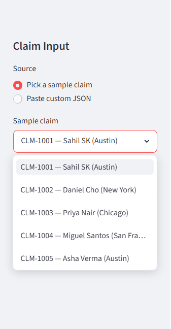
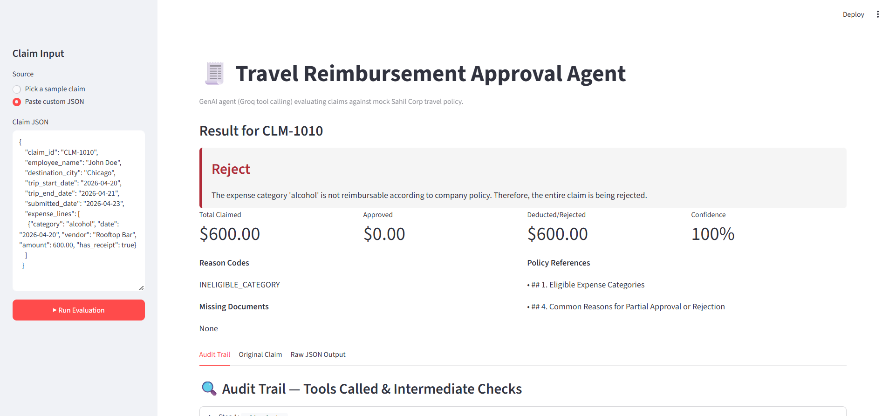
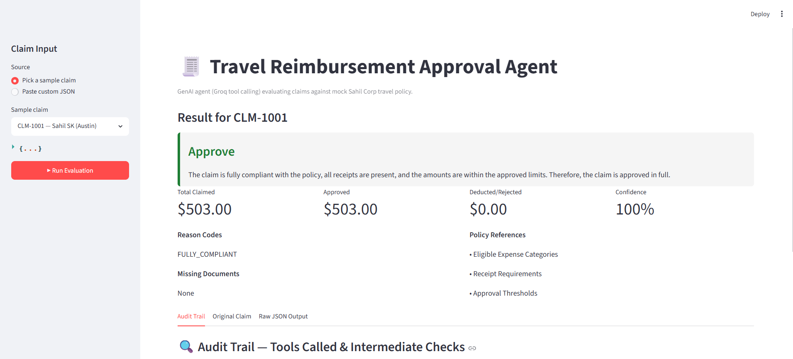
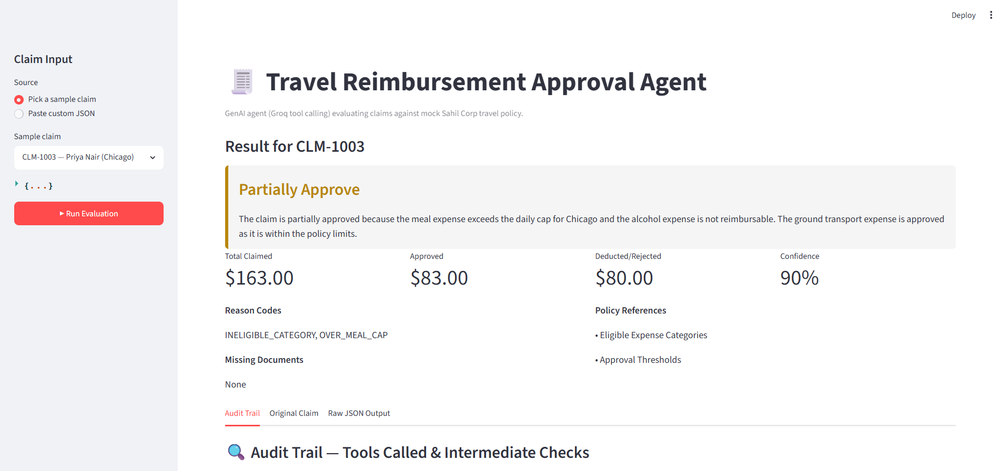
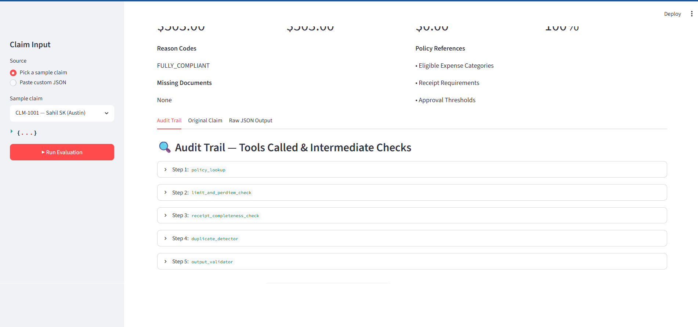
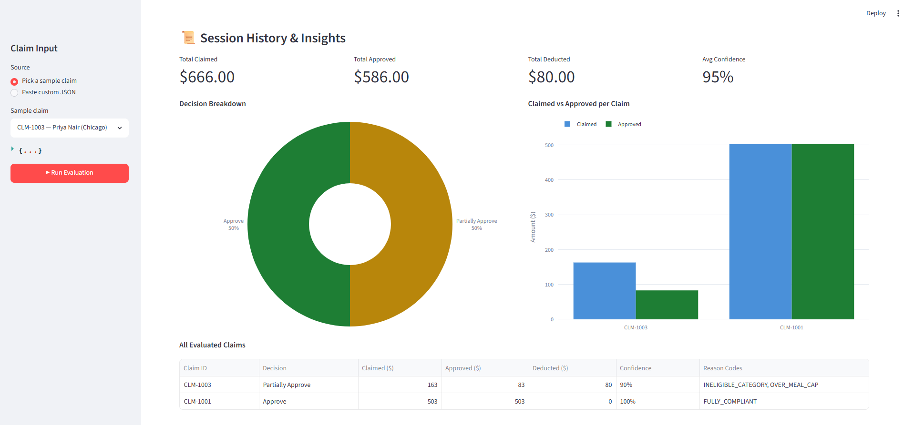

# Travel Reimbursement Approval Agent - Demo Evidence

Screenshots of the live Streamlit application covering all key UI features and decision types.

---

## Screenshot 1 - Sample Claim Selector (Dropdown Input Mode)

**What this shows:**
- The **sidebar claim input panel** with "Pick a sample claim" selected as the input source.
- A **dropdown listing all 5 pre-loaded sample claims** - CLM-1001 through CLM-1005 - each labelled with the claim ID, employee name, and destination city.
- This is the quickest way to demo the agent: pick a claim, click Run Evaluation, and the result appears immediately.

**Key feature demonstrated:** Built-in sample claim selector for fast demo/testing without needing to manually construct a JSON payload.

---

## Screenshot 2 - Custom JSON Paste (Manual Input Mode) + Reject Decision

**What this shows:**
- The sidebar switched to **"Paste custom JSON"** input mode, with a free-text area containing a manually entered claim (CLM-1010, John Doe, Chicago, single alcohol expense of $600).
- The main panel showing the result: a **Reject** decision (red card) for the custom claim.
- The explanation reads: *"The expense category 'alcohol' is not reimbursable according to company policy. Therefore, the entire claim is being rejected."*
- Metric tiles: Claimed $600.00 / Approved $0.00 / Deducted $600.00 / Confidence 100%.
- **Reason Codes:** `INELIGIBLE_CATEGORY`. **Policy References:** Section 1 (Eligible Expense Categories) and Section 4 (Common Reasons for Rejection).

**Key feature demonstrated:** The agent is not limited to pre-loaded samples - any valid claim JSON can be pasted and evaluated in real time. This also demonstrates the **Reject** decision path for a clearly ineligible category.

---

## Screenshot 3 - Approve Decision

**What this shows:**
- **Decision card in green** (`Approve`) for CLM-1001, Asha Verma, Austin TX.
- Metric tiles: Total Claimed $503.00 / Approved $503.00 / Deducted $0.00 / Confidence 100%.
- **Reason Code:** `FULLY_COMPLIANT` - no issues found.
- **Policy References:** Eligible Expense Categories, Receipt Requirements, Approval Thresholds - the exact sections the agent retrieved and grounded its decision on.
- **Missing Documents:** None.

**Key feature demonstrated:** Happy-path approval - lodging ($200/night) within Tier 2 Austin cap ($220), meals within $65/day cap, all receipts present, no duplicates.

---

## Screenshot 4 - Partially Approve Decision

**What this shows:**
- **Decision card in amber** (`Partially Approve`) for CLM-1003, Priya Nair, Chicago IL.
- Metric tiles: Claimed $163.00 / Approved $83.00 / Deducted $80.00 / Confidence 90%.
- **Reason Codes:** `INELIGIBLE_CATEGORY`, `OVER_MEAL_CAP` - two separate issues identified.
- The explanation: meal expense exceeds the daily cap for Chicago and alcohol expense is not reimbursable; ground transport is approved as it is within limits.
- **Policy References:** Eligible Expense Categories, Approval Thresholds.

**Key feature demonstrated:** Line-level deduction logic - the agent approves the legitimate portion of the claim rather than rejecting everything, and clearly separates the approved vs deducted amounts with specific reason codes for each issue.

---

## Screenshot 5 - Audit Trail (Tool Call Inspector)

**What this shows:**
- The **Audit Trail tab** for CLM-1001, listing every tool the agent called in sequence - 5 steps total.
- Each step is a collapsible panel labelled with the step number and tool name in monospace:
  - **Step 1: `policy_lookup`** - topics searched and matching policy sections returned.
  - **Step 2: `limit_and_perdiem_check`** - per-line cap results for each expense line.
  - **Step 3: `receipt_completeness_check`** - confirmed all required receipts present.
  - **Step 4: `duplicate_detector`** - confirmed 0 duplicate matches in processed log.
  - **Step 5: `output_validator`** - confirmed structured output passes schema validation.
- Expanding any panel shows the exact arguments passed to the tool and the full result returned.

**Key feature demonstrated:** Full **audit trail and explainability** - every tool call is logged with its inputs and outputs. An approver or auditor can inspect exactly how and why the agent reached its decision, satisfying the "audit trail showing retrieved context, tools called, and intermediate checks" requirement.

---

## Screenshot 6 - Session Insights Dashboard

**What this shows:**
- The **Session History & Insights** panel that appears automatically after evaluating more than one claim in the same session.
- **Four aggregate metric tiles:** Total Claimed ($666.00), Total Approved ($586.00), Total Deducted ($80.00), Avg Confidence (95%) - rolled up across all claims evaluated so far.
- **Donut pie chart** (interactive Plotly) showing decision type breakdown - Approve 50%, Partially Approve 50% - colour-coded green/amber to match the decision cards.
- **Grouped bar chart** showing Claimed vs Approved amounts per Claim ID side by side, making it immediately clear which claim had a large deduction.
- **All Evaluated Claims table** at the bottom with columns for Claim ID, Decision, Claimed ($), Approved ($), Deducted ($), Confidence, and Reason Codes.

**Key feature demonstrated:** Multi-claim **insights dashboard** - accumulates results across runs in the session so a reviewer can spot patterns at a glance (e.g. repeated cap breaches, frequent Manual Review for a particular employee or city).

---

## Feature Coverage Summary

| Feature | Screenshot |
|---|---|
| Sample claim dropdown selector | 1 |
| Custom JSON paste (manual claim input) | 2 |
| Reject decision - ineligible category | 2 |
| Approve decision - fully compliant | 3 |
| Partially approve - line-level deductions + reason codes | 4 |
| Audit trail - step-by-step tool calls with args + results | 5 |
| Session insights - pie chart, bar chart, aggregate metrics | 6 |
| Confidence score on every decision | 3, 4 |
| Policy references grounding each decision | 2, 3, 4 |
| Missing documents identification | 3, 4 |
